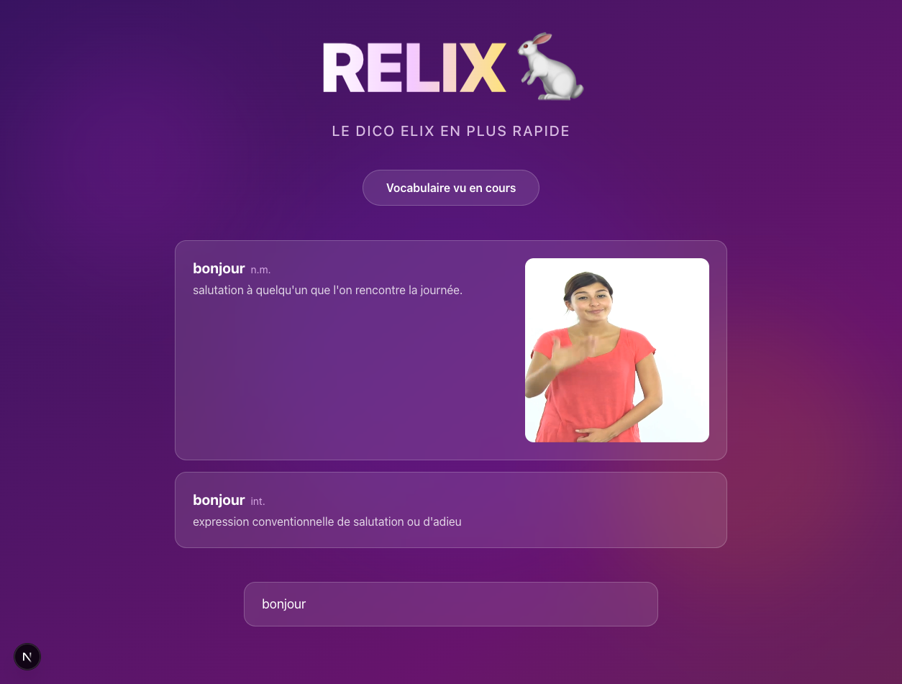

# RELIX 🐇

**Le Dico Elix, en plus rapide**

> Recherchez des signes de la Langue des Signes Française (LSF) dans le dictionnaire Elix, rapidement et simplement.



## ✨ Fonctionnalités

- **Recherche instantanée** — Les résultats s'affichent au fur et à mesure que vous tapez
- **Vidéos LSF** — Visualisez les signes en vidéo directement dans les résultats
- **URLs partageables** — Partagez un lien vers une recherche spécifique (ex: `/?q=bonjour`)
- **Vocabulaire de cours** — Accédez rapidement aux mots vus en cours

## 🚀 Démo

**[relix-mais-avec-cursor.vercel.app](https://relix-mais-avec-cursor.vercel.app)**

## 🤖 Généré avec Cursor

**100% du code de cette application a été généré avec [Cursor](https://cursor.com)**, l'éditeur de code propulsé par l'IA.

Ce projet est une réécriture de [RELIX original](https://github.com/dimitri-bourreau/relix), réalisée entièrement en pair-programming avec l'IA de Cursor.

## 🛠️ Stack technique

- **Next.js 16** (App Router)
- **TypeScript**
- **Tailwind CSS**
- **Playwright** (tests E2E)

## 📦 Installation

```bash
# Cloner le repo
git clone https://github.com/dimitri-bourreau/relix-mais-avec-cursor.git
cd relix-mais-avec-cursor

# Installer les dépendances
npm install

# Configurer les variables d'environnement
echo "ELIX_API_KEY=your_api_key" > .env.local

# Lancer en développement
npm run dev
```

## 🧪 Tests

```bash
# Lancer les tests E2E
npm run test:e2e

# Lancer avec l'interface UI
npm run test:e2e:ui
```

## 📝 Licence

MIT

---

*Fait avec ❤️ et beaucoup d'IA*
